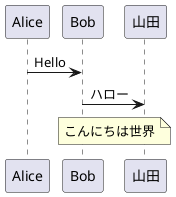
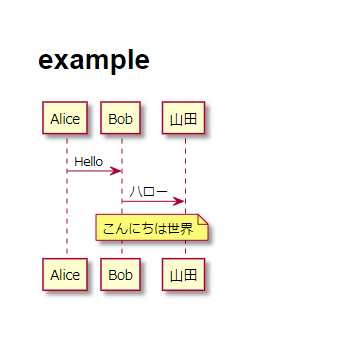
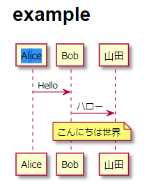

# About this

-   Convert PlantUML embedded in Markdown to an image with Pandoc and output it to HTML
-   No assets files, output to only single HTML file
-   Supports diagrams including Japanese and English
    -   Can probably use any language that PlantUML supports

## Requirements

-   [plantuml](https://plantuml.com/download)
-   [pandoc](https://pandoc.org/installing.html)
-   [Java](https://java.com/)

### for Windows

-   Unix shell

## Config

Configure following in the settings section of [ppml.sh](ppml.sh)

- Executable PlantUML path
- Executable Java path
- Include CSS path (Optional)
- Use Lua-Filter path (Optional)

## Usage

-   `./ppml.sh <input-md-file-path>`
    -   Output file to the \<input-path>/\<input-filename>.html
-   `./ppml.sh <input-md-file-path> <output-html-file-path>`

## Format example

### Input

-   [example/example.md](example/example.md)

````markdown
# example


````

### Output

-   [example/example.html](example/example.html)

**Screenshot HTML of above**



**Diagram text on HTML are selectable**

Diagram is output in SVG and embedded in HTML



## Thanks

Imported features

-   [diagram-generator.lua](diagram-generator.lua)
    -   [pandoc/lua-filters](https://github.com/pandoc/lua-filters)
-   [github.css](github.css)
    -   [andyferra/github.css](https://gist.github.com/andyferra/2554919)

```

```
